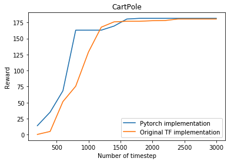
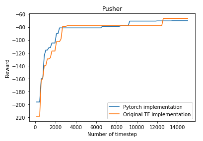
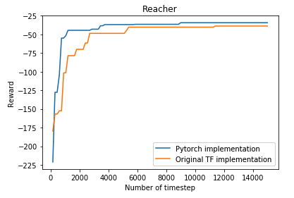

This repo contains a pytorch implementation of the wonderful model-based Reinforcement Learning algorithms proposed in [Deep Reinforcement Learning in a Handful of Trials using Probabilistic Dynamics Models](https://arxiv.org/abs/1805.12114).

As of now, the repo only supports the most high-performing variant: probabilistic ensemble for the learned dynamics model, TSinf trajectory sampling and Cross Entropy method for action optimization.

The code is structured with the same levels of abstraction as the original TF implementation, with the exception that the TF dynamics model is replaced by a Pytorch dynamics model.

I'm happy to take pull request if you see ways to improve the repo :).

## Performance

 



The y-axis indicates the maximum reward seen so far, as is done in the paper.

On the seed I have specified in the code, I could not get the same result as the paper on HalfCheetah. I had combed through the code but couldn’t find any potential bugs. 

I suspect the lower performance is because HC has deceptive modes in the objective function surface, and therefore high variance in performance. 

To get to 15k episode return, the HC needs to run on its legs. However, another mode is for the HC to flip on its back and wiggle its legs. 

Even SAC is stuck in this mode for some initial seeds. 

https://github.com/rail-berkeley/softlearning/issues/75

I didn’t have time to pursue this issue further. If you encounter this issue, try to render the behavior of the HC, I think that will be very helpful in figuring out the issue.

## Requirements

1. The requirements in the original [TF implementation](https://github.com/kchua/handful-of-trials)
2. Pytorch 1.0.0

For specific requirements, please take a look at the pip dependency file `requirements.txt` and conda dependency file `environments.yml`.

## Running Experiments

Experiments for a particular environment can be run using:

```
python mbexp.py
    -env    ENV       (required) The name of the environment. Select from
                                 [cartpole, reacher, pusher, halfcheetah].
```

Results will be saved in `<logdir>/<date+time of experiment start>/`.
Trial data will be contained in `logs.mat`, with the following contents:

```
{
    "observations": NumPy array of shape
        [num_train_iters * nrollouts_per_iter + ninit_rollouts, trial_lengths, obs_dim]
    "actions": NumPy array of shape
        [num_train_iters * nrollouts_per_iter + ninit_rollouts, trial_lengths, ac_dim]
    "rewards": NumPy array of shape
        [num_train_iters * nrollouts_per_iter + ninit_rollouts, trial_lengths, 1]
    "returns": Numpy array of shape [1, num_train_iters * neval]
}
```

To visualize the result, please take a look at `plotter.ipynb`

## Acknowledgement

Huge thank to the authors of the paper for open-sourcing their [code](https://github.com/kchua/handful-of-trials/). Most of this repo is taken from the official TF implementation.
